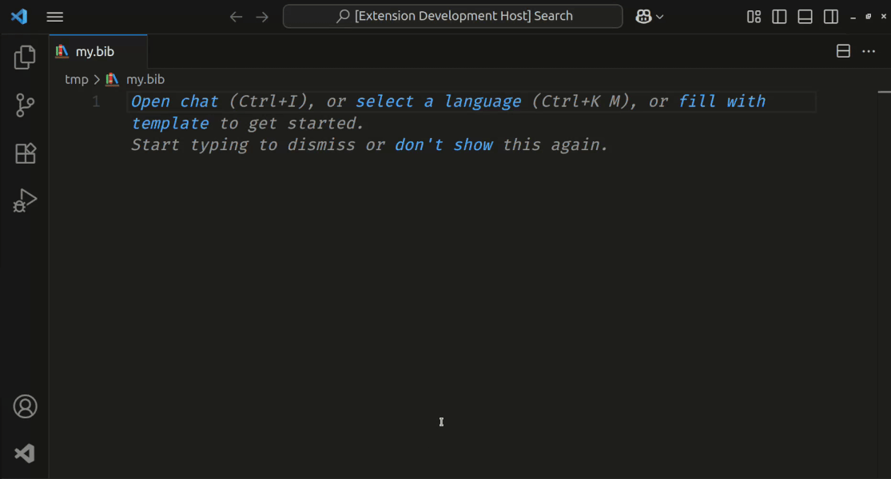

# `BibRef`: A VSCode Extension for BibLaTeX-friendly bibliography management

<!--  -->

## Overview

`BibRef` **will be** a Visual Studio Code extension designed to streamline your management of BibTeX and BibLaTeX bibliographies. Seamlessly integrated within VSCode, it simplifies the creation, editing, and insertion of academic references directly into your LaTeX, Markdown, or Typst documents.

> ⚠️ **This extension is in a very early development phase**, closest to _idea_ than to _MVP_. This README may not reflect the already implemented features. Feel free to contribute by reaching out to me or just sending PRs directly.

## Features

Features marked with a ✅ are already implemented.

* ✅ **Automatic metadata retrieval** using DOI or ISBN identifiers.
* **Create and edit** BibTeX and BibLaTeX entries quickly via intuitive forms.
* **Search and organize** references with advanced filtering and sorting.
* **Inline citation insertion** tailored to document type (LaTeX, Markdown, Typst).
* **Validation and linting** for cleaner, consistent bibliography files.
* Integration with existing LaTeX workflows (compatible with [LaTeX Workshop](https://github.com/James-Yu/LaTeX-Workshop)).

## Installation

Install directly through the [VS Code Marketplace](https://marketplace.visualstudio.com/items?itemName=coraldigital.bibref):

1. Launch **Visual Studio Code**.
2. Press `Ctrl+Shift+X` (or click on the Extensions icon).
3. Search for `BibRef`.
4. Click on **Install**.

## Quick Start

1. Press `Ctrl+Shift+P` or `F1` do open the Command Palette.
2. Search for `BibRef`
3. Run the command of your choice.
<!-- * **Open** or **create** a BibTeX file (`.bib`) in your project.
* Use the sidebar panel to manage and search entries.
* Insert citations quickly by using the command palette (`Ctrl+Shift+P`) and typing `bibref: Insert Citation`. -->

<!-- TODO: Detailed usage instructions will be added as features are implemented. -->

## Roadmap

Future enhancements include:

* Support for additional bibliography formats (CSL-JSON, RIS).
* Cloud synchronization via WebDAV/Git.
* PDF attachment and metadata extraction.
* AI-powered metadata enrichment.

## Contributing

Contributions are warmly welcomed! Please open issues or submit pull requests on the project's [GitHub repository](https://github.com/hellmrf/vscode-bibref).

## License

Licensed under the **[GPL-3.0 License](./LICENSE.md)**.
© 2025 Heliton Martins ([`@hellmrf`](https://github.com/hellmrf)).
